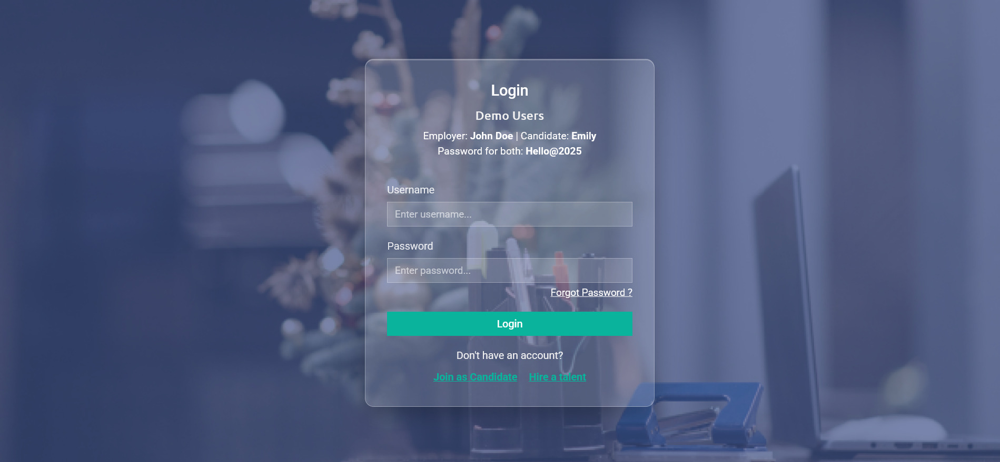
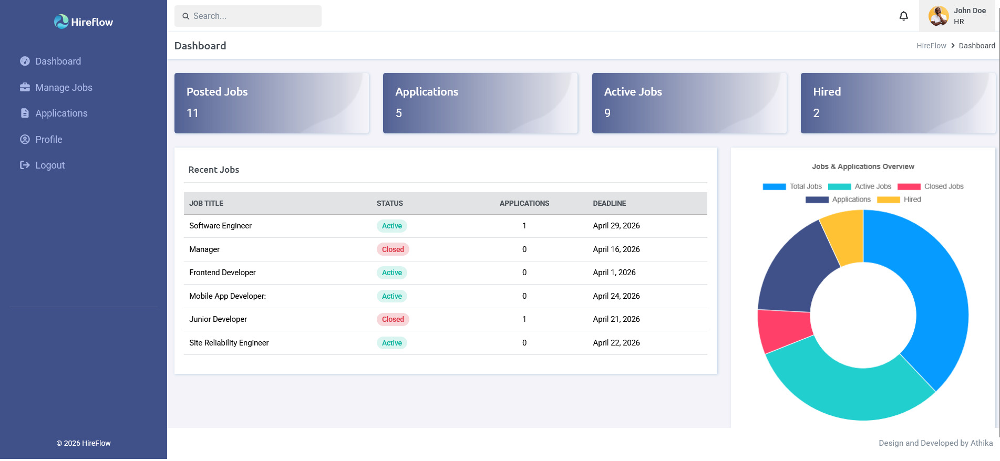
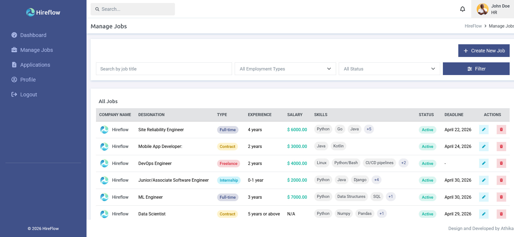
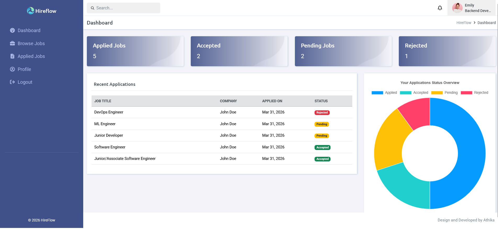
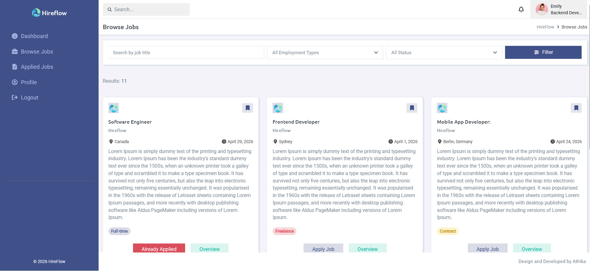

# HireFlow

   [](https://www.django-rest-framework.org/)  

## Overview
**Hireflow** is a full-stack job recruitment platform built with **Django and Django REST Framework**, designed to simulate a real-world hiring workflow between employers and candidates.

This project demonstrates backend engineering concepts such as **authentication, role-based access control, REST API design, media handling, and production deployment.**

> ⚡ Minimal design ensures focus on functionality and portfolio showcase, rather than a production-level system.

### Features
#### User Authentication & Access
    - Register, Login, and Password Reset
    - Role-based access: Employer vs Candidate
    - API token-based authentication

#### Employer Access
    - Create, Update, Delete, and Restore Jobs
    - View applications received for posted jobs
    - Accept or Reject candidate applications

#### Application Access
    - Candidates can apply to jobs
    - Resume upload support
    - Prevent duplicate applications

#### REST API
    - Fully functional REST API built with Django REST Framework
    - JSON-based communication

#### General
    - Jobs and applications are paginated
    - Filter jobs by title, employment type, or status
    - Cloudinary used for resume storage


### Tech Stack
| Feature | Technology |
|--------|------------|
| Backend | Python, Django, Django REST Framework | 
| Frontend | HTML, CSS, Bootstrap | 
| Database | SQLite (development), PostgreSQL (production) | 
| Media Storage | Cloudinary |
| Deployment | Render |
| Task Queue | Celery + Redis (used locally; disabled on Render free tier) |
| Tools | Git, GitHub, python-decouple |


### Demo & Repository
**Live Demo** : [HireFlow live](https://django-hireflow.onrender.com)  [](https://django-hireflow.onrender.com)

**Source Code** : [Github Repository](https://github.com/athikapriya/HireFlow) [](https://github.com/athikapriya/HireFlow)

### Preview
#### Login Page


#### Employer Dashboard


#### Employer Manage Jobs


#### Candidate Dashboard


#### Candidate Browse Jobs



### API Endpoints
| Method | Endpoint| Description | Auth Required |
| ------ | ------- | ----------- | ------------- |
| GET | `/jobs/` | List all active jobs | No |
| GET | `/jobs/<id>/` | Job details | No |
| POST | `/jobs/<id>/apply/` | Apply for a job | Yes |
| GET | `/employer/applications/` | Employer: list all received applications    | Yes (Employer only) |
| PATCH | `/applications/<id>/` | Update application status (accept/reject) | Yes (Employer only)   |
| GET   | `/users/<id>/` | Get user details | No    |
| POST  | `/auth/token/`    |   Obtain auth token   | No    |

> ⚠ Access is role-restricted. Employers cannot apply for jobs; candidates cannot manage jobs.


### Installation
#### Clone the repository :
```bash
git clone https://github.com/athikapriya/HireFlow.git
cd HireFlow
```

#### Create virtual environment :
```bash
python -m venv venv
```

##### Activate environment
###### Windows
```bash
venv\Scripts\activate
```

###### macOs/Linux
```bash
source venv/bin/activate
```

##### Install dependencies
```bash
pip install -r requirements.txt
```

##### Configure .env with:
Create a `.env` file in the project root and add the following:
```ini
SECRET_KEY=<your_django_secret_key>
DEBUG=True
CLOUDINARY_CLOUD_NAME=<your_cloud_name>
CLOUDINARY_API_KEY=<your_api_key>
CLOUDINARY_API_SECRET=<your_api_secret>
```

##### Run migrations
```bash
python manage.py migrate
```

##### Run development server
```bash
python manage.py runserver
```

### Email Handling

- **Local development:** Emails are sent asynchronously using Celery.
- **Production (Render free tier):** Email sending is disabled to avoid SMTP connection issues and worker crashes.

> Note: Background tasks (Celery + Redis) require a paid worker service on Render. In production, email functionality can be enabled using services like SendGrid or by upgrading to a paid plan.

### Usage
- Use Postman or your front-end client to interact with the API endpoints.
- Upload resumes through Cloudinary automatically when applying for jobs.
- Filter and paginate job listings via query parameters for cleaner browsing.


### Notes
- This project is minimal and primarily built for portfolio demonstration.
- Role-based API access ensures security between employer and candidate functionalities.
- Designed to be extendable for future features like email notifications or analytics.

### License
This project is licensed under the MIT License.   